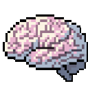

# Psytoolkit Questionnaire Formatter 

<!-- badges: start -->


<a href="https://twitter.com/intent/follow?screen_name=jakub_jedrusiak">

</a>

<!-- badges: end -->

A simple python tool for fast conversion of questionnaires into [PsyToolkit](https://www.psytoolkit.org/) format.


## Installing

### Source code

Best way to run this script is to use python source file. Make sure to install [python](https://www.python.org/) beforehand and chcek *Add python to PATH* while installing. `customtkinter` and 'pillow' modules is currently needed, so you need to install it by opening the terminal window and typing:

```bash
pip install customtkinter
```

```bash
pip install pillow
```

### Windows executable

Use [releases](https://github.com/jakub-jedrusiak/Psytoolkit-Questionnaire-Formatter/releases) to download the current .exe file. Known problems include a need to click on something multiple times before it starts to work.

## Scoring

This tool allows for setting scores for the questionnaire's items as well as **reversing scores for selected items**. To add scores to your scale, use appropriate buttons. You can use settings to change scoring convention (incremental, decremental or fixed for manually adding a the scoring without having to write `{score=X}` each time). To reverse the scale for an item, add an asterisk `*` at the end of the item. Reversing uses the input order and ignores items that are not scored.

## To-do

- [X] Options like random, requied etc.
- [X] Scoring
- [X] radio
- [X] drop
- [X] check
- [ ] scale
- [ ] range
- [ ] textline
- [ ] textbox
- [X] rank
- [X] info
- [ ] images
- [ ] sounds
- [ ] videos
- [ ] time options

## Note

This is a community tool. I'm not a PsyToolkit developer nor author. That would be prof. Gijsbert Stoet.
